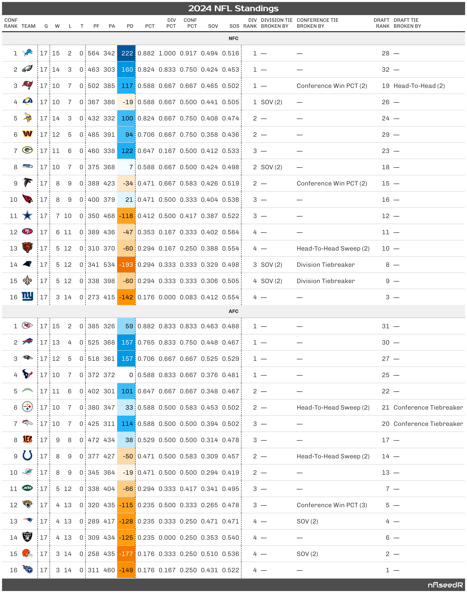

# Compute Pretty NFL Standings Table

Uses the R package gt to create a pretty html table of NFL standings.

## Usage

``` r
nfl_standings_prettify(
  standings,
  ...,
  grp_by = c("div", "conf", "nfl"),
  order_by = c("div_rank", "conf_rank", "draft_rank"),
  reverse = FALSE
)
```

## Arguments

- standings:

  A table of NFL standings. Usually computed by
  [`nfl_standings()`](https://nflseedr.com/reference/nfl_standings.md)

- ...:

  Currently unused. The function errors if objects are passed to the
  dots, i.e. when unnamed arguments are provided.

- grp_by:

  Group the output table by Division (`"div"`), Conference (`"conf"`),
  or complete league (`"nfl"`)

- order_by:

  Order teams by division rank, conference rank, or draft rank

- reverse:

  Teams are sorted by the argument `order_by` in ascending order by
  default. If `reverse` is set to `TRUE`, order will be reversed.

## Value

An object of class `gt_tbl`.

## Output of below examples



## Examples

``` r
# \donttest{
# Calculate standings
s <- nflreadr::load_schedules(2024) |>
  nflseedR::nfl_standings(ranks = "DRAFT")
#> ℹ 20:30:57 | Initiate Standings & Tiebreaking Data
#> ℹ 20:30:57 | Compute Division Ranks
#> ℹ 20:30:57 | Compute Conference Ranks
#> ℹ 20:30:57 | Compute Draft Order

# Create table
tbl1 <- nfl_standings_prettify(s, grp_by = "conf", order_by = "conf_rank")
tbl2 <- nfl_standings_prettify(s, grp_by = "nfl", order_by = "draft_rank")

# The output of tbl1 and tbl2 is given in the above images.
# }
```
