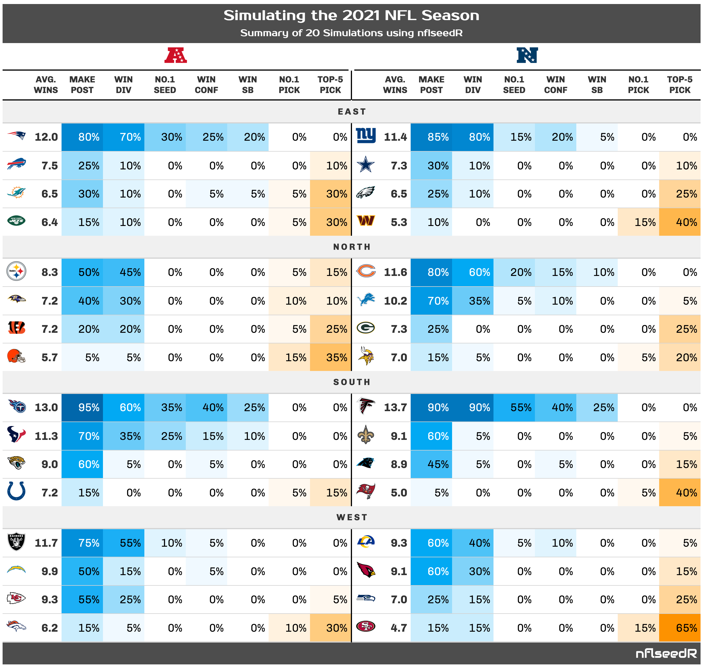

# Compute Pretty Simulations Summary Table

Uses the R package gt to create a pretty html table of the nflseedR
simulation summary data frame.

## Usage

``` r
# S3 method for class 'nflseedR_simulation'
summary(object, ...)
```

## Arguments

- object:

  an object for which a summary is desired.

- ...:

  additional arguments passed on to the methods (currently not used).

## Output of below example



## Examples

``` r
# \donttest{
library(nflseedR)
# set seed for recreation,
# internal parallelization requires a L'Ecuyer-CMRG random number generator
set.seed(19980310, kind = "L'Ecuyer-CMRG")

# Simulate the season 20 times in 1 round
sim <- nflseedR::simulate_nfl(
  nfl_season = 2021,
  fresh_season = TRUE,
  simulations = 20
)
#> ℹ 20:31:08 | Loading games data
#> ℹ 20:31:08 | Beginning simulation of 20 seasons in 1 round
#> ℹ 20:31:16 | Combining simulation data
#> ℹ 20:31:16 | Aggregating across simulations
#> ℹ 20:31:16 | DONE!

# Create Summary Tables
tbl <- summary(sim)

# The output of tbl is given in the above image.
# }
```
